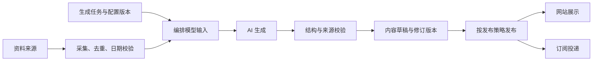

# 通用 AI 内容后台：生成管理与内容管理

状态：首版代码已实施，2026-09-16。通用任务、执行记录、内容与修订表已经接入；五篇历史快讯已建立兼容映射，公开读取继续使用 `ai_digests` 投影。模型适配器、调度器、worker 与两部分后台已实现，默认任务停用，真实模型凭据尚未配置。使用与部署见 [运行说明](operations.md)。下文保留完整架构设计，栏目与通用来源表的进一步拆分属于后续扩展。

执行方式已明确为服务端自动任务：采集、正文生成、主题配图、七牛上传、校验和定时发布都由后端完成。后台页面负责配置与查看结果，关闭浏览器不影响执行。具体进程、调度和恢复方案见 [服务端自动生成与定时发布](server-generation.md)。

## 产品结构

后台提供两个入口：

- **生成管理**：创建任务，配置输入资料、写作要求、模型、时间与发布方式；试运行，查看执行记录与失败原因。
- **内容管理**：按栏目、类型与状态浏览真实内容；预览、编辑、发布、撤回；追溯来源及生成配置。

“AI 快讯”是一项生成任务，产出到“AI 快讯”栏目。产品更新、内容周报、工具教程可以拥有各自任务与栏目，复用同一套执行和内容管理能力。一个栏目可以接受多个生成任务，也可以接受人工内容。



## AI 实际收到的输入

每次执行由程序组装输入，保留当次快照：

| 输入 | 例子 | 在哪里管理 |
| --- | --- | --- |
| 栏目目标与读者 | 面向个人开发者，关注可实际使用的 AI 进展 | 栏目与任务配置 |
| 本次上下文 | 期次日期、北京时间 09:00、采集窗口 | 运行时计算 |
| 已核验资料 | 来源 id、标题、原文时间、URL、事实摘要、可用图片及署名 | 采集器或人工资料 |
| 写作要求 | 中文、篇幅、语气、主题优先级、事实与点评分开 | 结构化选项与补充提示词 |
| 输出结构 | 标题、摘要、速览、内容块、图片引用、来源 id | 内容类型的版本化 schema |
| 已有内容摘要 | 最近数期已经报道的事件及时间 | 系统查询内容库 |
| 可用工具与资源 | 网页采集结果、媒体库素材、模型能力 | 服务端配置 |

新闻类任务必须先获取真实资料。模型按照来源 id 引用已有资料，程序再将 id 解析成可追溯的链接与时间。来源中的文本始终按资料处理。发布时间、文章状态、数据库 id、发信动作由程序控制，不由模型输出决定。

图片支持不同策略：使用来源中允许转载的图片、已有媒体素材、按内容制作示意图。保存文件 URL、替代文字、署名与使用依据。未获得图片时允许保留无图草稿，不输出一个猜测的网址。

### 示例：AI 快讯的一次任务输入

以下是输入契约示意，不是写入数据库的新闻数据。

```json
{
  "task": {
    "content_type": "daily_digest",
    "audience": "个人开发者与 AI 产品使用者",
    "language": "zh-CN",
    "target_chars": [700, 1500],
    "tone": "简洁、具体，避免夸张宣传",
    "instructions": "优先解释发生了什么、适用对象和实际限制。事实与 AI 简评分开。"
  },
  "edition": {
    "date": "由调度器计算",
    "timezone": "Asia/Shanghai",
    "publish_time": "09:00"
  },
  "source_documents": "本次采集并校验后的资料集合",
  "recent_content": "最近数期的已报道事件摘要",
  "output_schema": "daily_digest@1",
  "media_policy": "使用已提供的合法素材，或生成带说明的原创示意图"
}
```

最终提示词由“通用规则 + 内容类型模板 + 任务配置 + 本次资料”组合。后台首先展示明确的配置项，补充提示词放在高级设置中；输出 schema 与时间、权限等约束不能被自由提示词覆盖。

## 生成管理页面

### 任务列表

名称、目标栏目、内容类型、启用状态、下次执行时间、最近执行结果。支持创建、停用、复制和立即试运行。

### 任务配置

1. 基本信息：名称、目标栏目、内容类型。
2. 输入资料：来源适配器、主题筛选、时间窗口、手动补充资料。
3. 写作要求：受众、语言、篇幅、风格、内容重点、补充提示词。
4. 图片：素材来源、是否生成示意图、每篇图片范围。
5. 执行：模型、预算、超时、重试、时区、采集/生成启动时间。
6. 发布：计划发布时间、生成后保留草稿或校验通过后自动发布。
7. 试运行：查看本次实际输入、生成结果、校验项、耗时与用量；试运行产出草稿。

AI 快讯的发布时间是北京时间 09:00，因此采集和生成应提前启动。配置“生成启动时间”和“内容发布时间”两个字段，保证调度语义清楚。失败时记录原因并重试，不能用空白或虚构内容补足一期。

## 内容管理页面

列表支持栏目、内容类型、发布状态、生成任务、日期筛选。详情包含三个页签：

- **内容**：实际文章，预览与编辑。
- **资料**：来源、原文时间、采集时间、图片出处。
- **生成记录**：任务、配置版本、实际输入、模型、用量和校验结果。

人工编辑保存新修订，保留原始 AI 版本。修改任务配置影响后续执行，已生成的内容保持原样。重新生成先产生新草稿或候选修订，由发布策略决定后续操作。

## 数据结构建议

沿用现有字段中的来源追溯、业务日期、计划/实际发布时间、版本、任务锁与投递记录。核心概念调整为通用名称：

| 表 | 职责 |
| --- | --- |
| `content_channels` | 栏目：名称、slug、说明、默认展示与订阅选项 |
| `generation_tasks` | 任务身份、目标栏目、内容类型、启停状态、当前配置版本 |
| `generation_task_versions` | 不可变配置快照：输入策略、提示词、模型配置引用、输出 schema、调度、发布策略 |
| `generation_jobs` | 一次逻辑任务：目标期次、固定配置版本、执行目的、计划时间、状态、下次重试、锁与租约；定时触发去重 |
| `generation_runs` | 每次执行尝试：所属 job、输入快照、阶段、模型请求标识、产物、用量、错误和起止时间；重试新增记录 |
| `contents` | 内容身份、栏目、类型、标题、摘要、当前修订、草稿/发布/撤回状态、计划与实际发布时间 |
| `content_revisions` | 每版正文 JSON、schema 版本、作者类型、关联生成执行和修改记录 |
| `source_documents` | 来源资料：URL、原文日期/时间、采集时间、事实摘录、去重标识 |
| `content_sources` | 内容修订/内容块与来源资料的引用关系及证据快照 |

复用通用来源配置和媒体存储。确认、退订与发送逻辑沿用订阅设计，增加栏目订阅关联即可支持不同内容栏目。

内容类型先以代码注册适配器：`daily_digest`（快报）、后续的 `product_update`、`weekly_summary` 等。适配器定义输入校验、输出 schema、质量检查和前端渲染。提示词和运行参数由数据库管理。第一阶段实现快报适配器，再逐个增加类型。

### 唯一性与追溯

- 快报按“栏目 + 期次日期”去重；普通文章不强制一天一篇。
- 定时 job 的幂等键包含任务、目标期次与执行目的；同一 job 的重试保留独立 run 记录，不靠重复创建 job 实现重试。
- 正文保存 `content_type` 和 `schema_version`，老文章由对应版本渲染。
- 内容可由人工创建，生成任务/执行关联允许为空。
- 密钥继续保存在部署环境，配置仅保存凭据引用。

## 从现有实现迁移

1. 新建通用表和快报适配器，为现有日报配置创建对应栏目、任务与配置版本。
2. 迁移五篇日报及来源、图片、时间和执行记录，记录旧 id 到新 id 的映射。
3. 逐条核对正文摘要哈希、引用数、时区和发布状态；现有已发布内容保持已发布，草稿保持草稿。
4. 前端后台新增“生成管理 / 内容管理”入口；现有日报预览地址保留兼容跳转或查询映射。
5. 验证后切换读写，旧表先保留用于回查。后续接通真实模型、定时任务与发布流程。

首版实际采用 `generated_contents` 与 `content_revisions` 保存通用内容，复用已有 `ai_news_sources` / `ai_news_items` 及栏目设置；未为单栏目额外创建 `content_channels`。历史公开表作为兼容投影保留，生成后的新修订仅在发布时同步到该投影。
