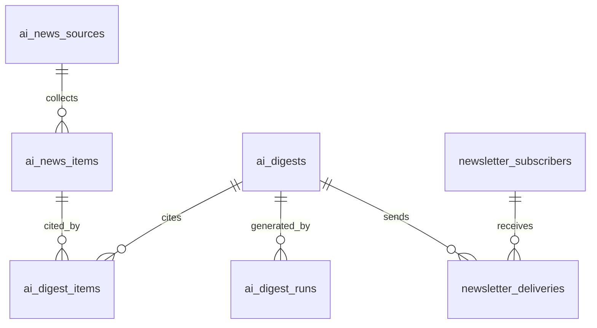

# AI 快讯：数据库设计 v1

状态：第一阶段已实施，2026-09-16。Alembic 迁移 `20260916_ai_digest` 已应用到当前连接的线上 `blog` 数据库；已保存 9 月 12—16 日五篇真实来源的快讯草稿。已根据首页展示要求，于 2026-09-16 将栏目改名为「AI 快讯」并发布这五期；前台通过公开 API 读取。未发送邮件。

## 1. 本次范围

本阶段完成数据结构、五篇真实来源的图文快讯和后台只读预览。后续正式系统按天自动采集、编排、校验、发布和发送；不设每日人工审批环节。配置、修改、撤回和手动重跑界面属于后续阶段。

已确定：Asia/Shanghai，每天 09:00 发布，每日最多一期；篇幅参考 700～1,500 中文字；优先最近 24 小时的公告，必要时补充 72 小时内的重要更新并标明原日期。时间、篇幅、主题和来源均由后台配置。历史补录使用 `scheduled_publish_at` 记录对应期次的 09:00（UTC 01:00），`created_at` 记录实际入库时间，`published_at` 仅在真正发布时填写。来源具有精确时间时保存 `published_at`；只有日期时不编造时间。回溯采集不能还原原文当时的网页状态，预览中已说明。

现有技术：Flask / SQLAlchemy / MySQL、Next.js、七牛图片存储、SMTP。新的快讯业务独立于 `posts` 和 `personal_profiles`，个人动态以后使用自己的表。

## 2. 八张表及职责

| 表 | 存什么 | 主要约束 |
| --- | --- | --- |
| `ai_digest_settings` | 栏目名称、发布时间、时区、生成偏好、模型配置引用 | 固定 id=1，由应用校验；默认自动发布与发信关闭 |
| `ai_news_sources` | 官方公告 / RSS / API 来源、解析配置、采集状态 | 来源入口 URL 的 SHA-256 唯一 |
| `ai_news_items` | 每篇原始消息的元数据、事实摘录、原文日期和去重信息 | 规范化原文 URL 的 SHA-256 唯一 |
| `ai_digests` | 一期最终快讯：标题、导读、结构化正文、图片、发布状态 | `issue_date` 唯一，每个业务日期最多一期 |
| `ai_digest_items` | 快讯的每个内容块用了哪些原文 | 快讯、内容版本、内容块、素材组合唯一 |
| `ai_digest_runs` | 每次采集 / 生成 / 校验任务的状态、锁、重试与用量 | `run_key` 唯一；失败重跑保留新一条记录 |
| `newsletter_subscribers` | 邮箱、确认状态、退订状态和订阅版本 | 规范化邮箱的 SHA-256 唯一 |
| `newsletter_deliveries` | 某一期发给某位订阅者的任务与结果 | 快讯 id + 订阅者 id 唯一 |

其中六张是核心业务数据，`ai_digest_items` 用来追溯出处，`ai_digest_runs` 用来让自动任务失败后能恢复。



## 3. 保存最终内容，而不依赖前端拼文章

`ai_digests.content_json` 是一整期的内容快照，包含导读、正文块、图片地址与说明、事实来源和 AI 简评。前端仅渲染这些数据；邮件由同一内容快照渲染。原文后续更新不能悄悄改变已发布快讯。

建议内容结构：

```json
{
  "schema_version": 1,
  "takeaways": ["速览一", "速览二", "速览三"],
  "cover": {"url": "七牛地址", "alt": "封面说明", "credit": "本站制图"},
  "sections": [{
    "id": "story-1",
    "kind": "news",
    "title": "本条标题",
    "paragraphs": ["有来源支持的事实摘要"],
    "analysis": "明确标为 AI 简评的推断",
    "image": {
      "url": "七牛地址", "alt": "图片内容", "caption": "图注",
      "credit": "图片署名", "source_url": "出处", "rights": "使用依据"
    },
    "sources": [{
      "item_id": 123, "title": "原文标题", "publisher": "发布方",
      "url": "原文地址", "published_date": "2026-09-15"
    }]
  }]
}
```

`summary` 用于首页与列表，`content_json` 用于详情与邮件。无需另外维护几份正文。`content_version` 在修改后增加；进入发信队列时冻结 `mail_snapshot_json`，同一期各订阅者收到同一版本。已发送邮件不能撤回，网页修订应显示更新时间；常规修改不触发第二次群发。

图文资产沿用七牛上传，数据库保存 URL、出处和使用依据；已发布图片被替换时保留旧文件，避免历史邮件中的图片失效。

## 4. 每日自动生成

1. 调度器按配置时区计算 `issue_date`，将采集窗口换算成 UTC。所有 `DATETIME` 统一存 UTC。
2. 按配置读取来源。区分原文发布时间、原文更新日期和采集时间，绝不把采集日期当成新闻日期。只有日期的来源用 `published_date` + `date_precision=date` 表示，不编造精确时间。
3. URL 规范化后算哈希，先做完全去重，再用 `event_key` 合并同一事件的不同报道。跨日用过去已发布内容检查是否有实质进展。
4. 将事实摘录和原文 id 交给生成器，输出符合 schema 的内容 JSON。采集文本属于资料，不能成为执行命令或修改发布规则的指令。
5. 校验来源对应关系、重要数字和日期、图片可用性、内容重复与长度。自动校验降低错误率，不等同于保证事实绝对正确。
6. 通过后写入快讯与引用关系，在同一事务内更新发布状态。`issue_date` 唯一键防止重复创建当天快讯。
7. 发布成功后冻结邮件内容，按当前有效订阅者创建发送任务。唯一键防止调度器重跑时重复入队。

单机初版可用系统定时任务 + 独立 worker + MySQL 锁/租约，不引入额外消息中间件。执行时持有带日期的互斥锁；长任务定期续租，写入前检查锁令牌。任务中断后可恢复到最后完成的阶段。配置初始关闭，正式接通数据与发信后再启用。

数据不足时减少条数并清楚标注较早信息；没有可验证来源或生成校验持续失败时标记失败并延迟本期。每日一期是正常目标，不能为凑数量捏造新闻。最多自动重试三次，后台展示失败阶段和简明原因。

## 5. 邮箱订阅和发送

- 输入邮箱 → `pending` → 确认邮件中的一次性链接 → `active`。无需网站账号，支持常见邮箱服务。
- 数据库只保存确认 token 的哈希；24 小时过期，用后作废。再次请求受邮箱/IP 限流，并给出统一响应，避免泄露某邮箱是否订阅。
- 退订链接使用独立的高熵 token，只保存哈希。邮件正文提供退订入口，支持邮件客户端的单击退订 POST。普通 GET 展示退订确认页，避免邮件安全扫描器误触发。
- 退订后立即停止创建新任务，发送前再次检查状态和 `subscription_version`；重新订阅必须再次确认，旧队列任务不能被恢复发送。
- 邮箱规范化策略在应用中固定；保留原始投递地址，域名使用小写/IDNA；不删除 `+tag` 或点号。不合并未经验证的不同地址。
- 单封发送分别记录 `queued / sending / accepted / failed / unknown / skipped / bounced`。SMTP 接受不等于最终送达，只有提供商回执才能记录 bounce/delivered。
- 明确失败可按退避策略重试。SMTP 超时可能发生在服务器已经收信之后，此时记录 `unknown`，不立即盲重发。仅靠数据库唯一键无法保证跨 SMTP 的严格「恰好一次」；后续可接入提供商幂等发送接口。
- 第一版仅订阅 AI 快讯。将来增加个人动态订阅时，再增加栏目/偏好关联表。

## 6. 字段和索引说明

完整字段见相邻 `schema.sql`。JSON 文档先沿用仓库的 `MEDIUMTEXT` + 应用层 schema 校验，避免假设现网 MySQL 原生 JSON 能力或依赖未启用的 CHECK 约束。URL 不直接建立超长唯一索引，使用二进制 SHA-256；哈希相同仍比较规范化原文，遇到冲突拒绝覆盖。

常用索引覆盖：已发布快讯按日期倒序、来源下的近期素材、活动订阅者、到期的待发任务、需要恢复的执行任务。外键默认 RESTRICT；来源优先停用，快讯优先撤回，不能删除仍被引用的数据。

模型名称、来源、时间、主题和提示词模板存数据库；密钥通过 `credential_ref` 指向部署环境中的 secret，不保存在公开配置或内容 JSON。API 只返回公开字段，订阅邮箱与任务错误详情仅管理员可见。

## 7. 已实施与后续范围

2026-09-16 更新：已进一步实施通用生成管理、内容修订、独立 scheduler / worker 与模型适配器；见 [运行说明](operations.md)。以下保留最初八张快讯表的职责，公开内容继续从原表读取兼容投影。自动任务尚未启用。

已实施：

- 八张表的模型与 Alembic 迁移，迁移前表清单保存在 `blog-assets/ai-digest/before-migration.json`。
- `GET /api/ai-digests/` 仅返回已发布内容；`manage=1` 需管理员权限，草稿详情对其他用户返回 404。
- `/manage/ai-digest` 为后台列表，`/manage/ai-digest/:id` 为预览；公开列表为 `/ai-news`，详情为 `/ai-news/:id`。内容和图片均来自数据库。
- 首页使用 `/api/ai-digests/home/`：按北京时间优先当天已发布快讯，否则显示最新一期并标为「最新快讯」；往期排除主篇，最多五条。
- 公开查询统一校验 published 状态、实际发布时间、计划时间和北京时间期次日期；未来内容、草稿和撤回内容均不展示。
- 发布前快照保存在 `blog-assets/ai-digest/publication-20260916-131020.json`。期次仍为 09:00，实际发布时间单独记录。
- 五篇快讯，16 个内容块、17 条来源记录及对应引用关系；每期北京时间 09:00，实际生成于 9 月 16 日。
- 原创 PNG 示意图上传七牛，使用内容哈希命名；本次未删除已有图片。
- 每期的实际数据快照保存在 `blog-assets/ai-digest/YYYY-MM-DD/digest.json`，导入记录在 `import-result.json`。
- `import_ai_digests.py` 默认为校验模式，显式 `--apply` 才写入；已有期次会拒绝覆盖。单次导入使用数据库事务，上传文件保留以便失败重试。
- 当前 `auto_publish=false`、`email_enabled=false`。仅预留订阅和发送表，没有创建订阅者或投递任务。

本地复查：

```bash
# 在已加载项目环境的 blog-backend 目录中
venv/bin/python -m unittest discover -s tests -p 'test_ai_digest.py' -v
venv/bin/python import_ai_digests.py ../blog-assets/ai-digest/backfill-20260912-20260916.json
```

后续实施顺序：

1. 接入可配置采集器、模型生成任务和自动校验，按 Asia/Shanghai 的 09:00 调度，并用同一期内容对照网页版和邮件版。
2. 完成订阅确认、退订、限流发送与任务恢复，再启用自动发布和订阅发送。
3. 补齐后台配置、编辑、撤回与失败重试入口。

验收关注：同日重跑不重复建期；来源日期与采集时间分开；内容可追溯；草稿不可公开访问；订阅者确认和退订正确生效；邮件版本与重试行为可追查。

## 参考

- [RSS 2.0：条目的原文链接、标识、发布日期与来源](https://www.rssboard.org/rss-specification)
- [RFC 8058：邮件单击退订](https://www.rfc-editor.org/rfc/rfc8058)
- [SMTP：消息已接收但连接异常时的重复投递问题](https://www.rfc-editor.org/rfc/rfc5321#section-6.1)

这些是通用订阅邮件设计，与接入任何特定邮箱品牌无关。
