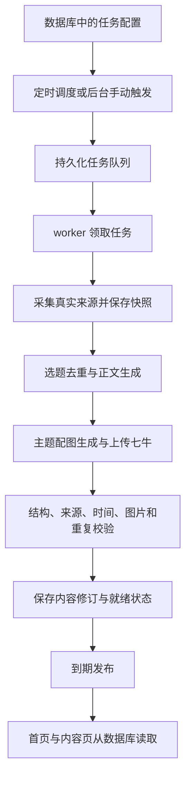

# 服务端自动生成与定时发布

状态：首版代码已实施，2026-09-16。本文为执行设计，实际实现、部署命令和限制见 [运行说明](operations.md)。scheduler / worker、模型适配器、后台配置与内容管理已完成；真实模型凭据尚未配置，自动任务未启用。现有五期内容和图片保持原样。

## 1. 职责与部署

整个生成流程在服务器执行，与管理员是否打开页面无关。任务配置、执行状态、来源、内容及图片地址都持久化到数据库。

沿用 Flask、MySQL 和现有 PM2 部署，增加两个独立的 Python 进程：

| 进程 | 职责 |
| --- | --- |
| `blog-server` | 提供网站 API、保存管理员配置、接受手动触发并返回任务编号 |
| `content-scheduler` | 定时检查数据库配置，创建到期任务、恢复过期租约、处理到期发布 |
| `content-worker` | 领取任务，执行采集、生成、图片处理、校验和保存 |

调度器约每 30 秒检查一次到期任务；发布误差通常在一个检查周期内，故障情况下按恢复规则处理。调度器不等待模型或图片请求，避免耗时生成阻塞 09:00 的发布检查。首版一个 worker，后续可增加 worker，领取与提交仍受数据库约束保护。

PM2 负责进程启动、日志和崩溃重启。每日业务调度由 scheduler 根据数据库执行；不在 Flask 初始化时启动定时器，避免 gunicorn worker 或开发热重载各启动一份任务。PM2 的 `cron_restart` 是进程重启机制，不作为内容任务队列。

本地连接线上数据库不代表本地可以执行线上任务。运行环境和执行开关由部署配置明确指定；默认关闭执行，生产任务仅允许生产 worker 领取，生成时同时检查任务是否启用。管理员关闭任务后停止后续生成和自动发布。

参考：[PM2 应用声明](https://pm2.keymetrics.io/docs/usage/application-declaration/)、[PM2 重启策略](https://pm2.keymetrics.io/docs/usage/restart-strategies/)。

## 2. AI 快讯的每日时间表

已确定的发布时间是 `Asia/Shanghai` 每天 **09:00**。建议生成提前 30 分钟开始；提前量、重试和延迟发布截止时间均为数据库中的任务配置。

| 时间／阶段 | 行为 |
| --- | --- |
| 08:30 | 为当日期次创建生成任务，采集并保存真实来源 |
| 随后 | 去重选题 → 正文生成 → 按本期主题生成配图 → 上传七牛 → 校验 → 保存待发布版本 |
| 09:00 | 只发布已经就绪、校验通过且允许自动发布的版本 |
| 生成失败 | 保存失败原因；暂时性错误按退避间隔重试 |
| 09:00 后完成 | 在配置的延迟发布窗口内发布，保留计划时间并记录真实发布时间 |
| 超过截止时间 | 当期停止自动执行，后台显示失败或待处理；不自动补造历史内容 |

生成开始时冻结来源截止时间，例如 08:30 开始采集则使用该时刻作为窗口上限，不假设已包含 09:00 前尚未发生的新闻。重试复用已保存资料；重新采集必须记录新的输入快照及窗口。

服务器重启后，根据数据库补查当天已到期且仍在允许窗口内的任务和待发布内容。历史缺期通过显式补录任务处理，避免重启后集中生成多日内容。

## 3. 通用执行链

“AI 快讯”通过 `daily_digest` 内容类型适配器接入。后续个人动态、产品更新和周报共用队列、模型接入、资产上传、执行记录和发布机制；分别定义资料输入、输出 schema 和校验规则。

资料采集、文本模型、图像模型分别使用服务端适配器，避免强制它们使用同一个供应商。服务商、模型与参数存数据库，密钥使用服务端凭据引用。网站现有聊天会话与自动内容任务分开，任务不依赖浏览器会话或本地编辑器。

## 4. 数据和状态

在通用内容设计中增加 `generation_jobs`，将“这一天要完成的工作”与“执行了几次”区分开：

- **task / task version**：任务身份与不可变配置。新 job 固定一个版本，运行中修改提示词不改变该 job。
- **job**：目标期次、执行目的、计划时间、状态、下一次重试时间、截止时间、租约和产物引用。
- **run**：同一个 job 的某次执行尝试，记录输入、各阶段产物、模型与请求标识、耗时、用量和错误；重试新增 run。
- **content / revision**：实际内容和修订版本，保存完整图文及来源引用，与执行记录关联。

job 状态使用 `queued → running → succeeded`，失败可以进入 `retry_wait` 或最终 `failed`，停用进入 `cancelled`。生成成功表示产物已保存；是否发布由内容状态和发布策略另外决定。

内容状态使用 `draft → ready → published → withdrawn`。只有通过校验的指定修订能够进入 `ready`。人工修改后需要重新校验，不能继承旧修订的校验结果。

### 防止重复与并发冲突

- 定时 job 唯一约束：`task_id + edition_key + purpose`；快讯的 edition 为北京时间日期。每次轮询命中同一记录，不重复创建。
- 快讯内容唯一约束：`channel_id + content_type + issue_date`。多个任务指向同一栏目，也不能发布两篇同日期快讯。
- worker 原子领取 job 并生成锁令牌，定期续租；每次提交阶段结果和最终内容时，都验证令牌及租约仍然有效。外部网络请求期间不持有数据库长事务。
- 租约失效由 scheduler 进入恢复流程；旧 worker 的迟到结果不能覆盖新执行的结果。
- 发布事务同时校验当前修订、校验结果、任务启用状态、发布时间和未发布状态。发布重复触发不会重复产生公开内容。

手动“试运行”保存草稿，不触发定时发布。手动“重新生成”创建候选修订，已发布版本继续服务，直到候选版本按明确的发布操作或策略替换。

## 5. 每期配图

配图是服务端流程的一部分，与正文内容一起保存：

1. 从本期选定的重点事件生成画面说明，结合站点蓝白风格。
2. 将近期封面主题和构图摘要加入输入，避免连续多期只改日期、复用同一构图。
3. 调用图像适配器，记录提示词、模型、生成时间和服务商请求标识。
4. 校验返回文件的真实格式、尺寸与大小，上传七牛；数据库保存 URL、替代文字、署名及 AI 生成说明。
5. 保存文件哈希检查完全重复；构图相似度作为质量检查，不能只靠 URL 不同判断图片不同。

快讯默认要求封面。配图失败时保留已生成正文，只重试图片阶段，未达到就绪条件时延迟发布。其他内容类型可配置不需要图片。替换已发布封面时保留旧文件，避免历史修订和邮件引用失效。

## 6. 失败恢复与观测

- 每个阶段分别设置超时与预算，保存完成结果；重试从可恢复的阶段继续。
- 暂时性网络故障、限流等采用退避重试，建议最多自动重试三次；凭据无效、配置不完整等直接标明需要处理，避免重复付费请求。
- 外部模型超时可能已经产生计费或产物。有请求标识或幂等接口时优先查询／复用，不能承诺跨供应商请求“恰好一次”。
- 来源不足或事实校验失败时保留失败原因，不为满足每天一期生成无来源内容。
- 记录 scheduler / worker 心跳、积压数、执行耗时、失败阶段和发布延迟。后台能区分“进程没有运行”和“模型生成失败”。
- API 返回公开内容与管理员运行摘要，日志和快照不包含模型密钥。

## 7. 实施与验收

实施顺序：

1. 建立通用 task、version、job、run 与内容修订结构，兼容现有五期快讯和公开地址。
2. 接入来源采集、文本和图片适配器，完成一次真实的服务端手动生成到草稿流程。
3. 接入 scheduler、worker、到期发布与恢复机制，提供 PM2 进程配置。
4. 后台形成“生成管理 / 内容管理”两个入口，展示下一次执行、运行日志、产物和发布状态。
5. 在隔离测试库验证并发、重试、时区边界、重启补查和撤回，再部署开启每日任务。

关键验收：关闭浏览器后仍能执行；08:30 重复轮询只创建一份 job；09:00 前不公开；生成未完成不发布；进程中断后能恢复；两个 worker 不重复提交；晚到结果不能覆盖新版本；正文成功而图片失败时不重复生成正文；本地连接线上数据库不会领取生产任务。

邮件订阅沿用独立投递队列，后续接入。内容生成／发布与邮件投递失败分别记录，不能因为邮件发送失败而重新生成或重复发布文章。
